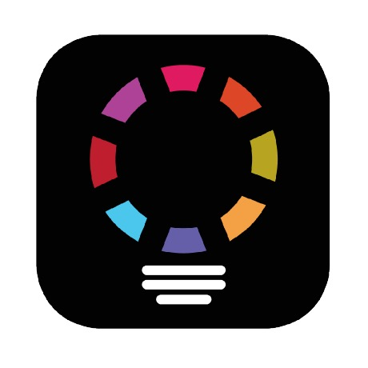
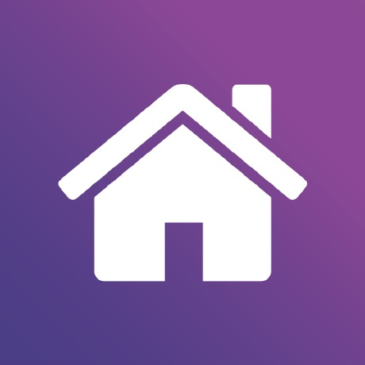
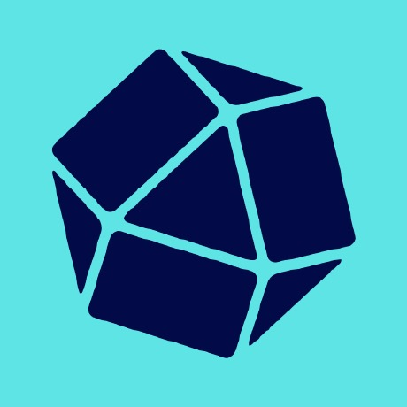
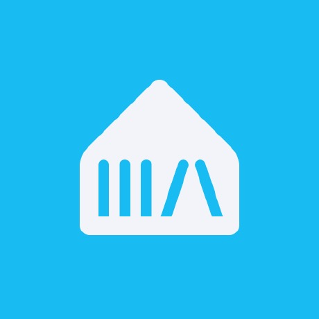
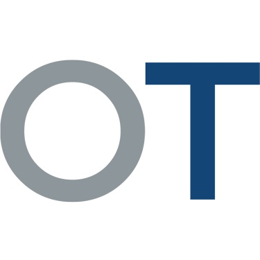
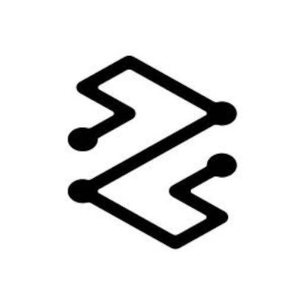

# Mistborn Store

A custom [Runtipi](https://runtipi.io) app store. A curated collection of self-hosted apps — focused on home automation, IoT and observability — packaged for one-click install on Runtipi.

## Using this store

Add this repository as a custom app store in your Runtipi instance:

1. Open Runtipi → **Settings → App Stores**
2. Add a new store with this repository URL:
   ```
   https://github.com/EckPhi/mistborn-store
   ```
3. The apps below become available in your app catalog.

See the [Runtipi custom app store guide](https://runtipi.io/docs/guides/create-your-own-app-store) for details.

## Apps

| | Name | Description |
|---|---|---|
|  | [AppDaemon](https://github.com/AppDaemon/appdaemon) | Python apps and HADashboard for Home Assistant automation |
|  | [diyHue](https://github.com/diyhue/diyHue) | Open-source Philips Hue bridge emulator |
|  | [Homey Pro](https://homey.app) | Run Homey Pro as a virtual smart-home hub |
|  | [Homeway](https://homeway.io) | Free remote access for Home Assistant |
|  | [InfluxDB](https://github.com/influxdata/influxdb) | Time-series database for metrics and events |
|  | [Music Assistant](https://github.com/music-assistant/server) | Music library manager and multi-room streaming |
|  | [OpenThread Border Router](https://github.com/openthread/ot-br-posix) | Thread mesh network border router |
|  | [VictoriaMetrics](https://github.com/VictoriaMetrics/VictoriaMetrics) | Fast, cost-effective time-series database |
|  | [Invoice Collector](https://github.com/invoice-collector/invoice-collector) | Automatically collect invoices from your suppliers |

## Repository structure

```
apps/
  <app-id>/
    config.json            # app metadata (Runtipi config schema)
    docker-compose.json    # dynamic compose definition
    metadata/
      description.md        # long description shown in the app page
      logo.jpg             # app logo
```

## Contributing / adding an app

The app-add process — file layout, schema rules and validation — is documented in [AGENTS.md](AGENTS.md). All apps are validated in CI against the official `@runtipi/common` schemas:

```bash
bun install
bun run test
```

## License

See [LICENSE](LICENSE).
