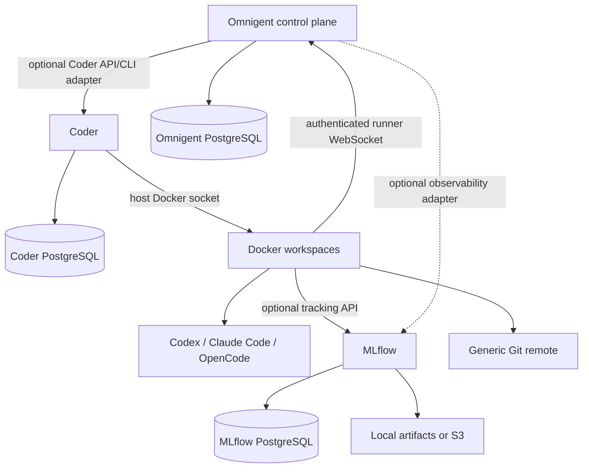

# Modular remote development platform

This store provides three independently installable apps. Live deployment acceptance is pending: this development environment has no Docker daemon/socket. Schema tests do not certify clean-VPS installs, IDE connections or persistence under reboot.



## Install and develop

Add this repository in RunTipi Settings → App Stores. Use RunTipi 4.10.1 or later. Install **Coder Development Environment** first. Supply admin username/email/password and a URL reachable from browsers AND workspace containers. For Tailscale use a tailnet DNS name or IP with scheme/port and ensure Docker containers can reach it. No public internet exposure is required. First startup builds the workspace image; monitor bootstrap readiness rather than expecting an instant install.

Open Coder, sign in, select `dev` from `general-development`. Connect VS Code or Cursor with the Coder Remote extension; JetBrains with its Coder integration/Gateway. CLI/SSH: install matching Coder CLI, run `coder login <url>`, `coder ssh dev`, or `coder config-ssh` and connect OpenSSH/Remote SSH to the generated hostname. See the [Coder app guide](../apps/coder-dev/README.md). IDE frontends are local; source, indexers, compilers and agents run remotely. GitHub/GitLab/Forgejo/Gitea/ordinary Git remotes all use standard Git credentials supplied by the user.

```sh
cd ~/workspaces
git clone <your-git-remote>
cd <project>
cmake -S . -B build
cmake --build build
ctest --test-dir build
```

`~/workspaces` links to persistent `/workspaces`. Home, source and caches have separate host bind paths keyed by Coder workspace UUID. Home and source survive container recreation and are deliberately retained after workspace deletion; clean them only after reviewing ownership/backups. The entire operating system is not persisted.

## AI agents and sessions

AI tools are enabled by default in the image, with pinned package versions. Disable through the template parameter if unnecessary. Tools include Codex, Claude Code, OpenCode and the optional Omnigent CLI. No credentials are in the image. Authenticate separately inside the workspace; don't distribute one shared administrator/LLM/Git secret pool.

```sh
tmux new -s agent
cd ~/workspaces/project
codex   # or claude, or opencode
```

Detach with Ctrl-B D and reconnect with `tmux attach -t agent`. IDE disconnects leave tmux running; stopping the workspace terminates processes, though persisted files remain. Check Coder auto-stop schedules before long tasks.

Persistent locations, verified against current upstream documentation:

| Tool | State |
| --- | --- |
| Codex | `~/.codex/config.toml`; file-backed login at `~/.codex/auth.json` (`CODEX_HOME` can override). Headless systems can select `cli_auth_credentials_store = "file"`. |
| Claude Code | `~/.claude/` plus `~/.claude.json`; provider credentials/session data may also be stored by platform-specific credential mechanisms. Back up the whole home. |
| OpenCode | `~/.config/opencode/` config; `~/.local/share/opencode/auth.json` credentials and data. |
| Omnigent | `~/.omnigent/`, including `auth_tokens.json`, configuration and runner identity. |

Sources: [Codex auth](https://learn.chatgpt.com/docs/auth), [Claude settings](https://code.claude.com/docs/en/settings), [OpenCode CLI](https://opencode.ai/docs/cli/), [Omnigent CLI](https://github.com/omnigent-ai/omnigent/blob/v0.16.0/omnigent/cli.py). Tokens/authentication require user login; paid provider calls are not part of acceptance testing.

## Docker modes and security

Coder's control plane discovers the Docker socket GID at boot, adds its runtime user to that group and drops privileges to UID 1000. It never makes the socket world-writable. Host Docker access gives effectively administrative host control. This is a trusted-user platform; Docker workspaces do not provide a hostile multitenancy boundary.

Default workspace: no socket, no Docker daemon. `Enable Docker development` optionally provisions an **experimental rootless Docker sidecar**, using a shared Unix socket and separate daemon data. It does not receive the host socket and introduces no TCP listener. The official rootless-DinD image nevertheless requires a privileged container/user-namespace support. This is a significant host capability grant and is not certified here as a strong security boundary. Test kernel/user-namespace/AppArmor compatibility before enabling. Its named Docker data volume persists stop/start, but is disposable on workspace deletion or parameter disable and is outside native RunTipi app-data backups. Keep source outside it. Compose bind paths are resolved in the sidecar, so use named volumes/build contexts instead of assuming workspace paths are available to that daemon. Published sidecar ports are not automatically reachable through Coder workspace forwarding.

The alternative `Host Docker socket access` is trusted-user mode, off by default. It grants root-equivalent host control. The two daemon modes cannot be selected together. Rootless Podman requires separate user-namespace/storage configuration; Sysbox requires host runtime installation. Neither is silently installed by this app. [Docker rootless guidance](https://docs.docker.com/engine/security/rootless/).

Only the Coder control plane normally has the host socket. Each app has independent internal PostgreSQL; backing services have no host ports. No database/filesystem sharing is needed for integration.

## Networking and IDE acceptance

RunTipi generates the main routing and port map. Coder SSH traverses the supported agent tunnel, without publishing host SSH or workspace ports. Run `coder port-forward dev --tcp 3000:3000` for an application; repeat for 5173, 8000 and 8080. Start an HTTP fixture on each corresponding workspace port and test both CLI forwarding and Coder workspace-app access before certifying networking. Keep port-forward listeners local unless deliberately configuring exposure. DNS/certificate/Coder access-URL mismatches are frequent causes of an offline workspace agent.

IDE acceptance remains interactive: VS Code, Cursor, JetBrains, CLI SSH, Tailscale routing and all four forwarded ports must pass the [acceptance checklist](../tests/coder-dev/ACCEPTANCE.md). A working Compose document is insufficient evidence of these connections.

## Omnigent and integration credentials

Install [Omnigent](../apps/omnigent/README.md) separately; create the first admin through its UI. Start its host/runner in a Coder workspace after `omnigent login <url>`. The supported external-runner WebSocket protocol supplies the central UI with workspace execution. No development toolchain is duplicated in the server.

Provision a separate Coder integration member, grant use of `general-development`, then create a token while logged in as that member using `coder tokens create --lifetime 168h`. Store it as the optional Omnigent integration secret or a protected adapter environment. Inspect the pinned CLI's `tokens create --help` for available scopes/allow-lists and select only necessary operations; do not assume workspace-read can create workspaces. Coder credentials inherit account authorization; this app never exports bootstrap administrator credentials to Omnigent. Revoke/rotate integration tokens independently of developer logins. APIs use `Coder-Session-Token`; CLI uses `CODER_SESSION_TOKEN`. The contract name `CODER_API_TOKEN` is mapped by an adapter, not an upstream automatic integration.

The installer fields reserve an optional Coder/MLflow contract. **No native Omnigent Coder provisioning provider is implemented in this release.** The experimental [CLI bridge](../scripts/platform/task.py) creates an explicitly named workspace through supported Coder commands and connects an Omnigent host over Coder SSH. It must run in a separately authenticated operator/adapter environment, not the minimal Omnigent server. It is not wired into the UI scheduler. Automatic issue selection, PR creation, cleanup policy and workflow authorization remain future work. Existing workspaces are never silently adopted by this prototype.

## MLflow

Install [MLflow](../apps/mlflow/README.md) independently. Configure optional `MLFLOW_TRACKING_URI` in each workspace template, and separately load client username/password. Install `mlflow==3.16.1` in the project's virtual environment. SDK logging, artifacts, tracing and evaluations use the standard endpoint. No image rebuild is needed to change tracking URLs. An endpoint alone does not instrument an agent. Omnigent's agent-plane OTLP configuration requires a deliberate exporter/collector integration; that automatic integration is pending. Local artifacts are supported initially; S3 is optional and server-proxied.

## Backups and cleanup

| App | Critical | Reproducible/disposable |
| --- | --- | --- |
| Coder | PostgreSQL, bootstrap identity/config, developer homes, source files, installer secrets | images, build output, ccache, Conan/npm/pnpm/pip/uv caches |
| Omnigent | PostgreSQL accounts/tasks/session state, server configuration, artifacts, cookie secret | image layers and temporary runner state after review |
| MLflow | PostgreSQL tracking/auth metadata, configuration, local artifacts or external object storage | image layers; artifacts only after an approved retention decision |

RunTipi 4.10.1 native backups cover app-data directories and installation configuration; they do not automatically cover arbitrary Docker volumes or external S3. Quiesce writers and verify workspace shutdown before a Coder backup. Use a consistent database dump/snapshot and artifact copy for separate backup tooling. Encrypt backups: homes and installation config contain credentials. Restore each app independently on a disposable installation with matching host paths, DB credentials and object keys; existing Coder bootstrap tests do not establish actual restore behavior.

ccache is capped at 10 GB per workspace. Monitor `docker system df` and disk usage. Review unused images before `docker image prune`; review cache before `docker builder prune --keep-storage 20GB`. Avoid `docker system prune --volumes`, which can destroy unrelated data. In a stopped or idle workspace, review `conan cache clean`, `pnpm store prune`, `npm cache clean --force`, `python3 -m pip cache purge`, and `uv cache prune`; package cache cleaning is not source cleanup. Identify old agent workspaces through Coder metadata, stop them first and delete only after reviewing source/PR/backups. RunTipi cannot automatically exclude all disposable caches from native backups. MLflow GC/object lifecycle requires explicit retention policy; no unattended deletion is enabled.

## Upgrade and test

Renovate discovers pinned deployment images and annotated workspace tool versions. Database image bumps remain manual. Platform updates require review and regenerate embedded sources through the update helpers. App changes increment `tipi_version`. Back up, stage the upgrade, validate migrations and restore before production rollout; Coder template publication does not automatically restart/update existing workspaces.

```sh
bun install
bun run test
bun run lint:ci
python3 scripts/coder-dev/package.py
python3 scripts/platform/package.py
```

CI builds the general workspace image and runs tool/C++ smoke checks without paid LLM calls. For live integration, install the compatible MLflow SDK in an operator virtualenv, authenticate Coder CLI, load endpoint/MLflow credentials securely, then run:

```sh
python tests/platform/live.py prepare
# Restart each app independently in RunTipi.
python tests/platform/live.py verify
```

The test clones a small local Git fixture inside the remote workspace, performs a deterministic mock agent edit, compiles/tests it, logs MLflow parameters/metrics/artifacts and verifies them after restarts. It checks Omnigent reachability but not an authenticated runner session. Independently verify Omnigent task history before/after restart and runner reconnect; the mock action does not exercise multi-agent LLM execution. Repeat after image/template upgrades and host reboot. See [validation status](development-platform-validation.md).

Not safely automated here: IDE/UI authentication, provider logins, integration-account permission decisions, external bucket creation/retention, TLS/Tailscale host setup, production backup/restore, and destructive data cleanup. Live runtime, restart, upgrade and three-service tests remain pending on a Docker/RunTipi host by user direction.
